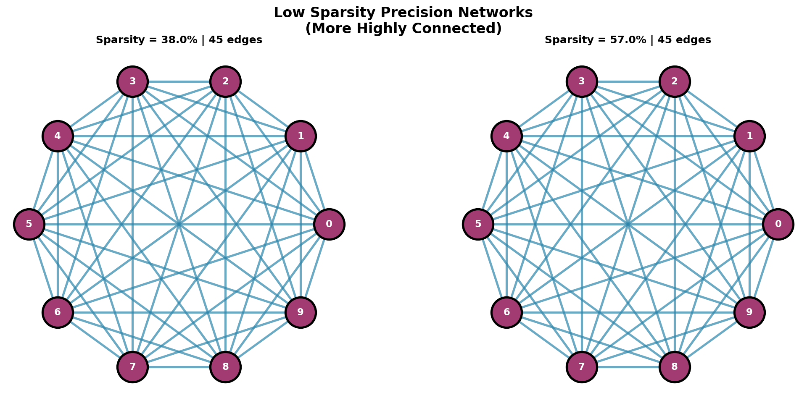
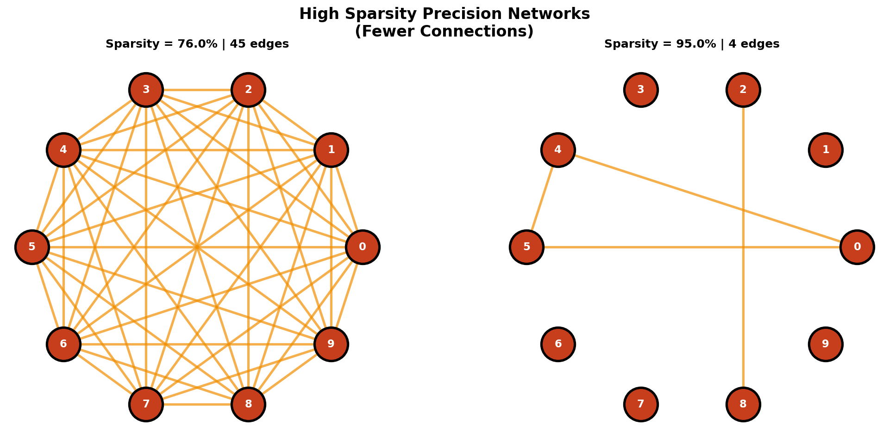

# EMgLASSO: EM-Based Gaussian Mixture Models with Sparse Covariance


## Overview

**emglasso** is an R package for model-based clustering in high-dimensional data with automatic discovery of sparse network structure within each cluster. 

The package combines the EM algorithm for Gaussian mixture models with graphical LASSO regularization to:
- **Cluster** your data into groups of similar observations
- **Estimate sparse covariance** (and precision/inverse covariance) matrices for each cluster
- **Discover network structure**: identify conditional independence relationships within each cluster

This is useful when you suspect your data comes from multiple subpopulations with distinct, sparse dependencies between variables.

## Installation

Install from GitHub:

```R
# Install devtools if needed
install.packages("devtools")

# Install emglasso
devtools::install_github("hrwatts/EMgLASSO")
```

## Quick Start

A minimal example to get you clustering in 60 seconds:

```R
library(emglasso)

# Generate synthetic data from a mixture of two Gaussians
set.seed(123)
Tau <- c(0.5, 0.5)           # Mixture proportions
Mu <- list(c(0, 0), c(5, 5)) # Component means
Sigma <- list(diag(2), diag(2)) # Component covariances
X <- rmmnorm(N = 200, D = 2, Tau = Tau, Mu = Mu, Sigma = Sigma)

# Fit the model
result <- emglasso(X, iTau = Tau)

# View results
str(result)
```

**Expected output:**
```
List of 2
 $ Theta:List of 3
  ..$ Tau  : num [1:2] 0.502 0.498
  ..$ Mu   :List of 2
  .. ..$ : num [1:2] 0.152 -0.078
  .. ..$ : num [1:2] 4.95 5.06
  ..$ Sigma:List of 2
  .. ..$ : num [1:2, 1:2] 0.996 -0.031 -0.031 0.987
  .. ..$ : num [1:2, 1:2] 1.024 0.045 0.045 1.031
 $ BIC   : num [1:2, 1:201] ...
```

## Main Functions

### Fitting the Model

- **`emglasso(x, iTau, Tol=1e-4, MaxIt=250)`**
  - Fits the EM algorithm for Gaussian mixtures with sparse covariance estimation.
  - Returns estimated mixture proportions (`Tau`), means (`Mu`), and sparse covariances (`Sigma`).
  - **Key arguments:**
    - `x`: Data matrix (n × d)
    - `iTau`: Initial mixture proportions
    - `Tol`: Convergence tolerance
    - `MaxIt`: Maximum EM iterations

### Generating Data

- **`rmmnorm(N, D, Tau, Mu, Sigma)`**
  - Generates samples from a Gaussian mixture model.
  - Useful for testing and simulation studies.

- **`rspdmatrix(D, lambda, epsilon=1e-4)`**
  - Generates random sparse positive definite matrices.
  - `lambda` controls sparsity (0 = dense, 1 = very sparse).
  - Useful for creating synthetic covariance matrices.

## Detailed Example: Clustering & Network Discovery

```R
library(emglasso)
library(network)

# Step 1: Create synthetic data with known structure
set.seed(42)
N <- 300
D <- 8
K <- 3
Tau <- c(0.3, 0.4, 0.3)
Mu <- list(rep(0, D), rep(2, D), rep(-2, D))

# Create sparse covariance matrices
Sigma <- list(
  rspdmatrix(D, lambda = 0.2),
  rspdmatrix(D, lambda = 0.3),
  rspdmatrix(D, lambda = 0.4)
)

X <- rmmnorm(N, D, Tau, Mu, Sigma)

# Step 2: Fit emglasso
result <- emglasso(X, iTau = Tau, MaxIt = 50)

# Step 3: Extract results
est_tau <- result$Theta$Tau        # Estimated proportions
est_mu <- result$Theta$Mu          # Estimated means
est_sigma <- result$Theta$Sigma    # Estimated sparse covariances

# Step 4: Visualize precision network for each cluster
for (k in 1:K) {
  # Precision matrix = inverse of covariance
  precision <- solve(est_sigma[[k]])
  
  # Create network from non-zero precision entries
  adj_matrix <- (precision != 0) & (row(precision) < col(precision))
  
  # Plot
  g <- network(adj_matrix)
  plot(g, main = paste("Cluster", k))
}

# Step 5: Cluster assignments (use highest posterior probability)
# This would require running the estep separately with final parameters
```

## Package Folder Structure

```
EMgLASSO/
├── R/                          # R source code
│   ├── emglasso.R             # Main EM algorithm
│   ├── estep.R                # E-step computation
│   ├── mstep.R                # M-step updates
│   ├── lstep.R                # Sparse covariance estimation
│   ├── rmmnorm.R              # Random sample generator
│   └── rspdmatrix.R           # Random sparse matrix generator
├── examples/                   # Example scripts and outputs
│   ├── run_emglasso_demo.R    # Basic usage demo
│   ├── plot_precision_networks.R  # Network visualization
│   └── output/                # Example outputs
├── tests/testthat/            # Unit tests
├── docs/                       # Supplemental documentation
├── figures/                    # Paper figures
├── generate_figures.py         # Reproducible manuscript figure generation
├── main.tex                    # Manuscript source
├── DESCRIPTION                # Package metadata
├── NAMESPACE                  # Namespace definition
└── README.md                  # This file
```

## Dependencies

The package requires:
- **mvtnorm**: For multivariate normal density calculations
- **glasso**: For graphical LASSO estimation
- **stats**: Base R statistical functions
- **MASS**: For multivariate normal sampling

Optional for examples:
- **network**: For visualizing network structure

## Running Examples

To run the included examples:

```R
# Navigate to the package directory
setwd("path/to/EMgLASSO")

# Generate precision network visualizations
source("examples/plot_precision_networks.R")

# Run full EM algorithm demo
source("examples/run_emglasso_demo.R")
```

Output files are saved to `examples/output/` and `figures/`.

To regenerate the manuscript network figures exactly as committed in this repository:

```powershell
python generate_figures.py
```

This requires Python with `numpy`, `matplotlib`, and `networkx` installed.

## Development Validation

For contributors and maintainers, run:

```R
devtools::document()
devtools::test()
devtools::check()
```

These steps should pass before opening or merging pull requests.

## How It Works

The algorithm proceeds in two stages:

### Stage 1: EM Algorithm
1. **Initialize**: Randomly allocate samples to clusters
2. **E-step**: Compute posterior responsibilities (soft cluster assignments)
3. **M-step**: Update cluster means, covariances, and proportions using weighted samples
4. **Repeat**: Until convergence

### Stage 2: Sparse Covariance Estimation
1. For each cluster, apply graphical LASSO to the estimated covariance matrix
2. Grid search over regularization penalties
3. Select penalty that minimizes BIC for each cluster
4. Return sparse covariance estimates

## Visual Example

Below are precision network visualizations showing how network sparsity affects the graph structure:

### Low Sparsity Networks (More Connected)
These represent scenarios where variables are more densely connected:



### High Sparsity Networks (Fewer Connections)
These represent scenarios with sparser relationships - only the strongest connections remain:



Notice how in the rightmost (95% sparse) network, only 4 edges remain out of 45 possible connections. This level of sparsity makes networks interpretable and computationally efficient.

## Common Pitfalls

1. **Initialization**: Provide reasonable initial cluster proportions (`iTau`). If all equal, consider `iTau = rep(1/k, k)`.
2. **Convergence**: If the algorithm doesn't converge, try increasing `MaxIt` or loosening `Tol`.
3. **Dimension**: Works best when `n > d * k` (more observations than parameters). High-dimensional low-sample regimes may need stronger regularization.
4. **Identifiability**: Clusters are not labeled; estimated component order may differ from the "true" order in simulations.

## References

- Dempster, A.P., Laird, N.M., and Rubin, D.B. (1977). Maximum likelihood from incomplete data via the EM algorithm. *Journal of the Royal Statistical Society*, Series B, 39, 1-38.
- Friedman, J., Hastie, T., and Tibshirani, R. (2008). Sparse inverse covariance estimation with the graphical lasso. *Biostatistics*, 9(3), 432-441.

## Citation

If you use this package in research, please cite:

```bibtex
@Manual{emglasso2018,
  title = {{EMgLASSO}: {EM}-Based Gaussian Mixture Models with Sparse Covariance},
  author = {Watts, Harrison},
  year = {2026},
  note = {R package version 0.1.0}
}
```

## License

This package is licensed under the GNU General Public License v2.0. The package metadata in `DESCRIPTION` is authoritative for installs and redistribution.

## Getting Help

- **Examples**: See `examples/` folder for working code
- **Function help**: Run `?emglasso`, `?rmmnorm`, etc. in R
- **Technical details**: See [main.tex](main.tex)
- **Issues**: Report bugs or feature requests at [GitHub Issues](https://github.com/hrwatts/EMgLASSO/issues)

## Contributing

Contributions are welcome! Please fork the repository, make your changes, and submit a pull request.
